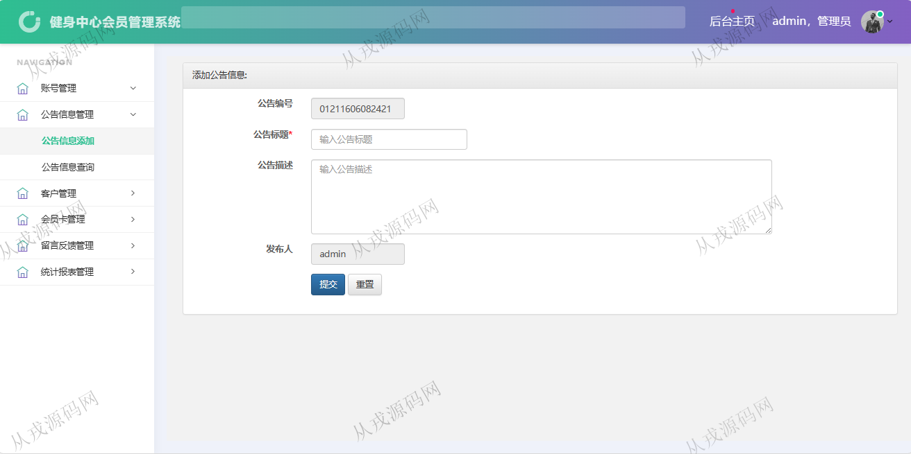

<h1 align="center">199.健身中心会员管理系统</h1>

- <b>完整代码获取地址：从戎源码网 ([https://armycodes.com/](https://armycodes.com/))</b>
- <b>技术探讨、资料分享，请加QQ群：692619798</b> 
- <b>作者微信：19941326836  QQ：952045282</b> 
- <b>承接计算机毕业设计、Java毕业设计、Python毕业设计、深度学习、机器学习</b>
- <b>选题+开题报告+任务书+程序定制+安装调试+论文+答辩ppt 一条龙服务</b>
- <b>所有选题地址 ([https://github.com/YuLin-Coder/AllProjectCatalog](https://github.com/YuLin-Coder/AllProjectCatalog)) </b>

## 项目介绍
基于springboot的健身中心会员管理系统：前端 jsp、jquery，后端 maven、springmvc、spring、mybatis；角色分为管理员、用户；集成会员卡、留言板、公告、统计报表等功能于一体的系统。

## 功能介绍

### 客户

- 基本功能：登录，退出，个人资料查看与修改，密码修改
- 我的会员卡：会员卡查询，详情
- 充值信息：充值信息的列表查询，多条件搜索查询，详情
- 我的消费记录：消费记录查询，多条件搜索查询，详情

### 管理员

- 账号管理：管理员账号信息的增删改查，密码修改
- 公告管理：公告信息的增删改查
- 客户管理：客户信息的增删改查
- 会员卡管理：会员卡信息的增删改查，多条件搜索查询，会员卡充值
- 留言板管理：留言板信息的列表查询，留言回复
- 统计报表管理：消费信息的查询统计，充值信息的查询统计

## 环境

- <b>IntelliJ IDEA 2021.3</b>

- <b>Mysql 5.7.26</b>

- <b>Tomcat 7.0.73</b>

- <b>JDK 1.8</b>

## 运行截图

